# Exact structures and maximal canonically Jordan recoverable subcategories for modules over type A algebras

Joint work with Benjamin Dequêne

  ICRA 2026 — Institut Fourier, Grenoble, France 
  June 29, 2026

---

# Plan

<v-clicks>

1. **Motivation** &nbsp;: Canonical Jordan Recoverability

2. **The Diamond Exact Structure** $\mathcal{E}_\diamond$

3. **The $\mathrm{GS}_\mathcal{E}$ Operator & Properties** &nbsp;*(First Main Theorem)* &nbsp;\[Dequêne–R., 2025\]

4. **Relative Mutations & Tilting Equivalence** &nbsp;*(Second Main Theorem)* &nbsp;\[Dequêne–R., 2025\]

</v-clicks>

---

# Settings

<v-clicks>

- $K$ is an algebraically closed field.

- $Q$ is a **Dynkin quiver** with no relations.

- $\operatorname{rep}(Q)$ denotes the category of finite-dimensional left $KQ$-modules.

- $\mathscr{A}$ will denote a **hereditary abelian category with enough projectives**.

- All subcategories are assumed full, closed under finite direct sums, and under direct summands.

</v-clicks>

---
layout: section
class: text-center
---

# I. Motivation

Canonical Jordan Recoverability

---

# Jordan Form Invariant

In representation theory, we often seek <strong>invariants</strong> that classify objects up to isomorphism.

<v-clicks>

The <strong>Jordan form</strong> is one of the simplest and most classical invariants attached to endomorphisms. It encodes essential structural information.

  <strong>Question</strong> &nbsp;— Can a representation be recovered from the Jordan forms of its nilpotent endomorphisms?

In recent work, <strong>Garver–Patrias–Thomas</strong> (2018–2022) introduced and developed the notions of <em>Jordan recoverability (JR)</em> and <em>canonical Jordan recoverability (CJR)</em>. These ideas were later expanded by <strong>Dequêne</strong> (2022–2024).

</v-clicks>

---

# Jordan Form for Representations

Let $E = (E_q, E_\alpha) \in \operatorname{rep}(Q)$ and $N = (N_q)_{q \in Q_0} \in \operatorname{NEnd}(E)$. Each $N_q$ is a nilpotent endomorphism of $E_q$.

**Definition**

The **Jordan form** of $N_q$ is the partition $\operatorname{JF}(N_q) \vdash \dim(E_q)$ recording its Jordan block sizes. Define the tuple

$$\operatorname{JF}(N) = \bigl(\operatorname{JF}(N_q)\bigr)_{q \in Q_0},$$

which describes the block structure of $N$ at each vertex.

---

# The Generic Jordan Form Invariant

Fix $E \in \operatorname{rep}(Q)$. For $N = (N_q)_{q \in Q_0} \in \operatorname{NEnd}(E)$, set $\operatorname{JF}(N) = (\operatorname{JF}(N_q))_{q \in Q_0}$.

**Definition \[GPT23\]**

The **generic Jordan form** of $E$ is the maximal value with respect to dominance order:

$$\operatorname{GenJF}(E) \;=\; \max_{N \,\in\, \operatorname{NEnd}(E)} \operatorname{JF}(N).$$

**Question** &nbsp;— Is this invariant complete?

---

# Jordan Recoverability

**Definition \[GPT23\]**

Let $\mathscr{C} \subseteq \operatorname{rep}(Q)$ be a full subcategory. We say that $\mathscr{C}$ is **Jordan recoverable (JR)** if

$$E \simeq F \;\iff\; \operatorname{GenJF}(E) = \operatorname{GenJF}(F) \qquad \text{for all } E, F \in \mathscr{C}.$$

**Remark**

The generic Jordan form $\operatorname{GenJF}$ is a **complete invariant** on $\mathscr{C}$.

---

# Canonical Jordan Recoverability (CJR)

**Definition \[GPT23\]**

Let $\mathscr{C} \subseteq \operatorname{rep}(Q)$. We say $\mathscr{C}$ is **canonically Jordan recoverable (CJR)** if, for every $X \in \mathscr{C}$, there exists a dense open set (Zariski) $\Omega \subseteq \operatorname{rep}\bigl(Q,\operatorname{GenJF}(X)\bigr)$ such that for all $Y \in \Omega$, $Y \simeq X$.

**Maximal CJR subcategory**

A CJR subcategory $\mathscr{C}$ is **maximal** if it is not properly contained in any larger CJR subcategory of $\operatorname{rep}(Q)$:

$$\forall\, \mathscr{D} \supsetneq \mathscr{C}, \quad \mathscr{D} \text{ is not CJR.}$$

---
layout: two-cols
---

# Example on $A_2$: JR but not CJR

Assume $Q : 1 \to 2$ and let $\mathscr{C} = \operatorname{add}(S_1, S_2)$.

<v-clicks>

Every $E \in \mathscr{C}$ has the form $\;E = K^a \xrightarrow{\;0\;} K^b$.

**Generic Jordan form:** $\;\operatorname{GenJF}(E) = \bigl((a),\,(b)\bigr).$

Hence $\mathscr{C}$ is **JR**.

</v-clicks>

::right::

**But $\mathscr{C}$ is not CJR.**

Consider $S_1 \oplus S_2 \cong K \xrightarrow{0} K$. Any dense open $U \subseteq \operatorname{rep}(Q,\,(1,1))$ contains $P_1 = K \xrightarrow{\lambda} K$ with $\lambda \neq 0$.

$$\operatorname{GenJF}(S_1 \oplus S_2) = \bigl((1),(1)\bigr) = \operatorname{GenJF}(P_1)$$

but $S_1 \oplus S_2 \not\simeq P_1$.

---

# Maximal CJR Subcategories in Type $A_n$

Let $Q$ be a quiver of type $A_n$.

**Proposition**

If $\mathscr{C} \subseteq \operatorname{rep}(Q)$ is a maximal canonically Jordan recoverable subcategory, then:

<v-clicks>

<em>(a)</em> $\mathscr{C}$ is extension-closed;

<em>(b)</em> $\mathscr{C}$ always contains a tilting representation.

</v-clicks>

**Theorem \[Deq23a\]**

A subcategory $\mathscr{C} \subseteq \operatorname{rep}(Q)$ is canonically Jordan recoverable if and only if every non-split short exact sequence

$$0 \longrightarrow X \longrightarrow Y \longrightarrow Z \longrightarrow 0$$

with $X, Z \in \mathscr{C}$ satisfies $Y \notin \operatorname{ind}\bigl(\operatorname{rep}(Q)\bigr)$.

---
layout: section
class: text-center
---

# II. The Diamond Exact Structure

$\mathcal{E}_\diamond$

---

# Exact Structures

**Definition**

A collection $\mathcal{E}$ of short exact sequences in $\mathscr{A}$ is an **exact structure** on $\mathscr{A}$ whenever $\mathcal{E}$ satisfies:

<v-clicks>

<strong>(ES1)</strong> &nbsp; All split short exact sequences are in $\mathcal{E}$.

<strong>(ES2)</strong> &nbsp; The collection of $\mathcal{E}$-monomorphisms and the one of $\mathcal{E}$-epimorphisms are both closed under compositions.

<strong>(ES3)</strong> &nbsp; $\mathcal{E}$ is closed under pushouts and pullbacks along any morphism.

</v-clicks>

  

    <AnimatedSVG :src="'/es3_pushout.svg'" viewBox="22 180 146 43" />
    <strong>(ES3-I)</strong> Pushouts

$\mathcal{E}$ is closed under pushouts.

  

  

    <AnimatedSVG :src="'/es3_pullback.svg'" viewBox="191 178 146 43" />
    <strong>(ES3-II)</strong> Pullbacks

$\mathcal{E}$ is closed under pullbacks.

  

---

# Exact Categories

**Definition**

Let $\mathcal{E}$ be an exact structure on $\mathscr{A}$. The pair $(\mathscr{A},\,\mathcal{E})$ is called an **exact category**.

<strong>Examples of Exact Structures</strong>

<v-clicks>

$\mathcal{E}_{\max}$ &nbsp;— the <strong>maximal exact structure</strong>, containing all short exact sequences.

$\mathcal{E}_{\min}$ &nbsp;— the <strong>minimal exact structure</strong>, containing only the split short exact sequences.

</v-clicks>

---

# Short Exact Sequences in Type $A_n$

**Theorem**

Let $Q$ be an $A_n$ type quiver. For a non-split exact sequence

$$0 \longrightarrow D \longrightarrow E \longrightarrow F \longrightarrow 0, \qquad D, F \in \operatorname{ind}(\operatorname{rep}(Q)),$$

exactly one of the following holds:

<v-clicks>

<em>(a)</em> $E \in \operatorname{ind}(\operatorname{rep}(Q))$,

<em>(b)</em> $E \cong E_1 \oplus E_2$ with $E_1, E_2 \in \operatorname{ind}(\operatorname{rep}(Q))$.

In case (b) we call it a <strong>diamond exact sequence</strong>.

</v-clicks>

---

# The Diamond Exact Structure $\mathcal{E}_\diamond$

**Definition**

Let $Q$ be an $A_n$ type quiver. We define the collection of short exact sequences $\mathcal{E}_{\diamond}$ given by the additive bifunctor $\mathcal{E}_\diamond(-,-)$, uniquely determined by

$$\mathcal{E}_\diamond(N,M) = \bigl\{\, \eta \in \operatorname{Ext}^1(N,M) \;\big|\; \eta \text{ splits or is a diamond exact sequence}\,\bigr\}$$

for $M, N \in \operatorname{ind}(\operatorname{rep}(Q))$.

**Proposition \[Brüstle–Hanson–R.–Schiffler, 2024\]**

Let $n \in \mathbb{N}^*$ and $Q$ be an $A_n$ type quiver. Then $\mathcal{E}_{\diamond}$ is an exact structure on $\mathscr{A} = \operatorname{rep}(Q)$.

---

# CJR via $\mathcal{E}_\diamond$

<v-clicks>

::div{class="theorem mt-2"}
**Recall** &nbsp;&#91;Deq23a&#93; &nbsp;A subcategory $\mathscr{C} \subseteq \operatorname{rep}(Q)$ is canonically Jordan recoverable if and only if every non-split short exact sequence $0 \to X \to Y \to Z \to 0$ with $X, Z \in \mathscr{C}$ satisfies $Y \notin \operatorname{ind}(\operatorname{rep}(Q))$.
::

::div{class="definition mt-5"}
**Definition** &nbsp;Let $(\mathscr{A}, \mathcal{E})$ be an exact category.

A subcategory $\mathscr{C} \subseteq \mathscr{A}$ is **$\mathcal{E}$-adapted** if for all $X, Y \in \mathscr{C}$, $\operatorname{Ext}^1(X, Y) \subseteq \mathcal{E}$.
::

::div{class="theorem mt-5"}
**Theorem** &nbsp;&#91;BR25&#93; &nbsp;A subcategory $\mathscr{C} \subseteq \operatorname{rep}(A_n)$ is canonically Jordan recoverable if and only if $\mathscr{C}$ is $\mathcal{E}_\diamond$-adapted.
::

::div{class="remark mt-4"}
**Remark** &nbsp;$\mathscr{C}$ is maximal canonically Jordan recoverable if and only if any subcategory $\mathscr{D} \supset \mathscr{C}$ is not $\mathcal{E}_\diamond$-adapted.
::

</v-clicks>

---
layout: section
class: text-center
---

# III. The $\mathrm{GS}_\mathcal{E}$ Operator & Properties

First Main Theorem

---
clicks: 16
---

# The Main Intuition

::div{class="theorem mt-4"}
**Recall** &nbsp;Assume $\mathscr{C} \subseteq \operatorname{rep}(A_n)$ is a maximal CJR subcategory. Then:

a) $\mathscr{C}$ is maximally $\mathcal{E}_\diamond$-adapted.

b) $\mathscr{C}$ is extension closed.

c) $\mathscr{C}$ contains a tilting module $T$.

::

  <FloatingBalls :visible="Math.max(0, $clicks - 3)" :seq-visible="Math.max(0, $clicks - 8)" :sec-visible="Math.max(0, $clicks - 13)" :highlight="$clicks >= 16" />

::div{v-click="8" style="position:absolute; bottom:2rem; left:calc(8rem - 30px); font-style:italic; font-size:1rem; color:#fc8181; display:flex; align-items:center; height:34px;"}
$T_i \in \operatorname{add}(T)$
::

::div{style="position:absolute; bottom:2rem; left:calc(18rem - 30px); display:flex; align-items:center; height:34px; gap:6px; font-size:0.9rem;"}
= 13 ? 1 : 0, transition: 'opacity 0.6s ease' }">$0 \to$ <SeqCircles /> $\to 0$= 15 ? 0 : ($clicks >= 13 ? 1 : 0), transition: $clicks >= 15 ? 'none' : 'opacity 0.6s ease', pointerEvents: 'none', width: $clicks >= 15 ? '0' : 'auto', overflow: 'hidden', display: 'inline-block' }">$\ \in \mathcal{E}_\diamond$= 15 ? 1 : 0, transition: 'opacity 0.6s ease 0.05s', marginLeft: '-6px' }">$,\quad 0 \to$ <SeqCircles left="K'₂" mid="C₂" right="C'₂" left-color="#63b3ed" mid-color="#68d391" right-color="#63b3ed" /> $\to 0\,,\quad 0 \to$ <SeqCircles left="K'₄" mid="K₄" right="C'₄" left-color="#63b3ed" mid-color="#68d391" right-color="#63b3ed" /> $\to 0\ \in \mathcal{E}_\diamond$
::

---

# The $\operatorname{Gen}_\mathcal{E}$ and $\operatorname{Sub}_\mathcal{E}$ Operators

Let $(\mathscr{A}, \mathcal{E})$ be an exact category.

**Definition**

For a subcategory $\mathscr{C} \subseteq \mathscr{A}$, we define:

<v-clicks>

<em>(a)</em> &nbsp; $\operatorname{Gen}_{\mathcal{E}}(\mathscr{C}) = \{ C \in \mathscr{A} \mid \exists\, g : Y \twoheadrightarrow C,\; Y \in \mathscr{C},\; g\ \mathcal{E}\text{-epi} \}$

<em>(b)</em> &nbsp; $\operatorname{Sub}_{\mathcal{E}}(\mathscr{C}) = \{ K \in \mathscr{A} \mid \exists\, f : K \rightarrowtail Y,\; Y \in \mathscr{C},\; f\ \mathcal{E}\text{-mono} \}$

</v-clicks>

For an object $M \in \mathscr{A}$, we set $\operatorname{Gen}_\mathcal{E}(M) = \operatorname{Gen}_\mathcal{E}(\operatorname{add}(M))$ and $\operatorname{Sub}_\mathcal{E}(M) = \operatorname{Sub}_\mathcal{E}(\operatorname{add}(M))$.

---

# The $\operatorname{GS}_\mathcal{E}$ Construction

**Definition**

Let $\mathscr{C} \subseteq \mathscr{A}$ be a subcategory.

<v-clicks>

<em>(a)</em> &nbsp; Set $\operatorname{GS}_{\mathcal{E}}^0(\mathscr{C}) = \mathscr{C}$.

<em>(b)</em> &nbsp; For $i \geq 1$, define

$$\operatorname{GS}_\mathcal{E}^i(\mathscr{C}) = \operatorname{add}\!\Bigl(\operatorname{Gen}_\mathcal{E}(\operatorname{GS}_\mathcal{E}^{i-1}(\mathscr{C})) \;,\; \operatorname{Sub}_\mathcal{E}(\operatorname{GS}_\mathcal{E}^{i-1}(\mathscr{C}))\Bigr).$$

</v-clicks>

<strong>Remark.</strong> $(\operatorname{GS}_\mathcal{E}^i(\mathscr{C}))_{i \in \mathbb{N}}$ is an increasing sequence of subcategories of $\mathscr{A}$.

---

# The $\operatorname{GS}_\mathcal{E}$ Operator

**Definition**

The $\operatorname{GS}_\mathcal{E}$-operator is defined by

$$\operatorname{GS}_\mathcal{E}(\mathscr{C}) = \varinjlim_{i \in \mathbb{N}} \operatorname{GS}_\mathcal{E}^i(\mathscr{C}) = \bigcup_{i \in \mathbb{N}} \operatorname{GS}_\mathcal{E}^i(\mathscr{C}).$$

Equivalently, $\operatorname{GS}_\mathcal{E}(\mathscr{C})$ is the <strong>smallest subcategory</strong> of $\mathscr{A}$ that contains $\mathscr{C}$ and is closed under both $\operatorname{Gen}_\mathcal{E}$ and $\operatorname{Sub}_\mathcal{E}$.

For an object $M \in \mathscr{A}$, we set $\operatorname{GS}_\mathcal{E}(M) = \operatorname{GS}_\mathcal{E}(\operatorname{add}(M))$.

---

# Example: $\operatorname{GS}_{\mathcal{E}_\diamond}$ on $A_7$

  <PausableVideo src="/poset_full_anim.webm" :pausePoints="[2.5, 6.7, 13.1, 17.3, 23.8, 28.0, 34.5, 38.7, 45.2, 49.4, 55.9, 60.1, 66.6, 70.8, 77.3, 81.5, 88.0]" :playbackRate="1.5" />

<GsFormulas :step="Math.max(0, $clicks - 17)" style="position:absolute; top:38%; right:2rem;" />

---

# Nice Properties of $\operatorname{GS}_\mathcal{E}$

**Proposition**

Let $\mathscr{C} \subseteq \mathscr{A}$ be a subcategory.

<v-clicks>

1. If $\mathscr{C}$ is $\mathcal{E}$-adapted, then $\operatorname{GS}_\mathcal{E}(\mathscr{C})$ is also $\mathcal{E}$-adapted.

2. If $\mathscr{C}$ is $\mathcal{E}$-adapted and extension-closed, then $\operatorname{GS}_\mathcal{E}(\mathscr{C})$ is also extension-closed.

</v-clicks>

<v-clicks>

<strong>Corollary 1.</strong> Let $T \in \mathscr{A}$ be a tilting object. Then $\operatorname{GS}_\mathcal{E}(T)$ is $\mathcal{E}$-adapted and extension-closed.

<strong>Corollary 2.</strong> Let $T \in \operatorname{rep}(A_n)$ be a tilting object. Then $\operatorname{GS}_{\mathcal{E}_\diamond}(T)$ is canonically Jordan recoverable.

<strong>Question:</strong> Is $\operatorname{GS}_{\mathcal{E}_\diamond}(T)$ maximal canonically Jordan recoverable?

</v-clicks>

---

# First Main Theorem

**Theorem \[DR25\]**

Let $T \in \mathscr{A}$ be a tilting object. Then $\operatorname{GS}_\mathcal{E}(T)$ is a **maximal** $\mathcal{E}$-adapted, extension-closed subcategory of $\mathscr{A}$ containing $T$.

*In particular, every maximal canonically Jordan recoverable subcategory arises as $\operatorname{GS}_{\mathcal{E}_\diamond}(T)$ for some tilting object $T$.*

How can we describe the equivalence relation $\;T \sim_\mathcal{E} T' \iff \operatorname{GS}_{\mathcal{E}}(T) = \operatorname{GS}_{\mathcal{E}}(T')$?

---
layout: section
class: text-center
---

# IV. Relative Mutations & Tilting Equivalence

Second Main Theorem

---

# Classical Mutation = 2 ? 1 : 0, transition:'opacity 0.4s' }">($\mathcal{E}$-mutation)

**Definition**

Let $T = U \oplus \overline{T}$ be a tilting object with $U$ indecomposable.

A= 2 ? '1em' : '0', opacity: $clicks >= 2 ? 1 : 0, transition:'font-size 0.3s, opacity 0.3s' }">n = 2 ? '1em' : '0', opacity: $clicks >= 2 ? 1 : 0, transition:'font-size 0.3s, opacity 0.3s', color:'#60a5fa' }">$\mathcal{E}$-**mutation** of $T$ at $U$ is a tilting object $\mu_U(T) = U' \oplus \overline{T}$, where $U'$ is obtained from $U$ by an = 2 ? '1em' : '0', opacity: $clicks >= 2 ? 1 : 0, transition:'font-size 0.3s, opacity 0.3s', color:'#60a5fa' }">$\mathcal{E}$-exchange sequence

$$\xi:\; 0 \rightarrow U \xrightarrow{f} B \xrightarrow{g} U' \rightarrow 0, \qquad B \in \operatorname{add}(\overline{T}),$$

= 2 ? 1 : 0, transition:'opacity 0.4s' }">

$$\xi:\; 0 \rightarrow U \xrightarrow{f} B \xrightarrow{g} U' \rightarrow 0\,\textcolor{#60a5fa}{\in \mathcal{E}}, \qquad B \in \operatorname{add}(\overline{T}),$$

where $f$ is a left minimal $\operatorname{add}(\overline{T})$-approximation of $U$, and $g$ is a right minimal $\operatorname{add}(\overline{T})$-approximation of $U'$.

We write $\textcolor{#e2b96f}{\mu_U^+(T)}$ (resp. $\textcolor{#e2b96f}{\mu_U^-(T)}$) for the right (resp. left) mutation.

= 2 ? 1 : 0, transition:'opacity 0.4s' }">

We write $\textcolor{#e2b96f}{\mu_{U,\textcolor{#60a5fa}{\mathcal{E}}}^+(T)}$ (resp. $\textcolor{#e2b96f}{\mu_{U,\textcolor{#60a5fa}{\mathcal{E}}}^-(T)}$) for the right (resp. left) $\mathcal{E}$-mutation.

---

# $\mathcal{E}$-Reachability

**Definition**

Let $T, T' \in \operatorname{Tilt}(Q)$.

$T'$ is **$\mathcal{E}$-reachable** from $T$ if there exist indecomposables $(U_1, \dots, U_m)$ such that

$$T' \cong \mu_{U_m,\mathcal{E}} \circ \cdots \circ \mu_{U_1,\mathcal{E}}(T).$$

**$\mathcal{E}$-reachability** $T \approx_{\mathcal{E}} T'$ forms an equivalence relation. We denote $[T]_{\approx_\mathcal{E}}$ for the equivalence class of $T$.

---

# Equivalence of Tiltings

**Earlier question** &nbsp;— How can we describe $T \sim_\mathcal{E} T' \iff \operatorname{GS}_{\mathcal{E}}(T) = \operatorname{GS}_{\mathcal{E}}(T')$?

**Proposition**

Let $T, T' \in \operatorname{Tilt}(Q)$. Then

$$T \sim_{\mathcal{E}} T' \quad \Longleftrightarrow \quad T \approx_{\mathcal{E}} T'.$$

---

# Example: $Q = 1 \to 2 \leftarrow 3 \to 4$ with $\mathcal{E} = \mathcal{E}_\diamond$

  <iframe src="https://ar-quiver-simulator.vercel.app" style="width:154%; height:154%; border:none; transform:scale(0.65); transform-origin:top left;" />

---

# Equivalence of Tiltings

**Example.** Assume $Q = 1 \to 2 \leftarrow 3 \to 4$ and $\mathcal{E} = \mathcal{E}_\diamond$.

  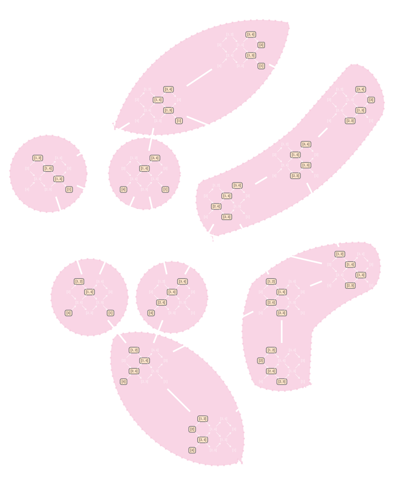
  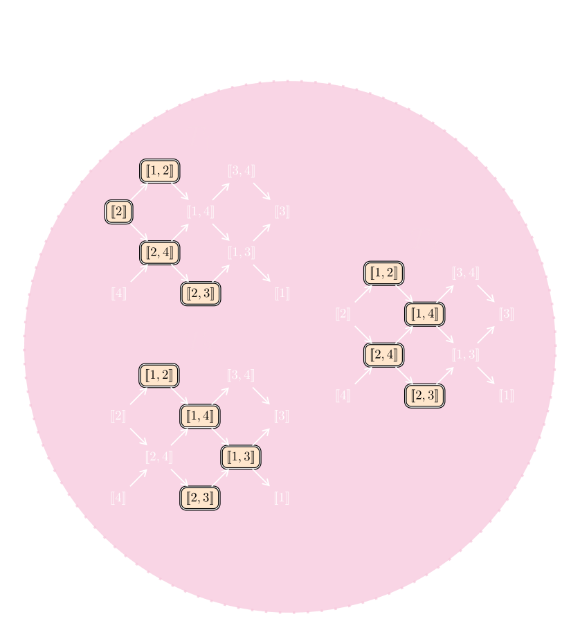
  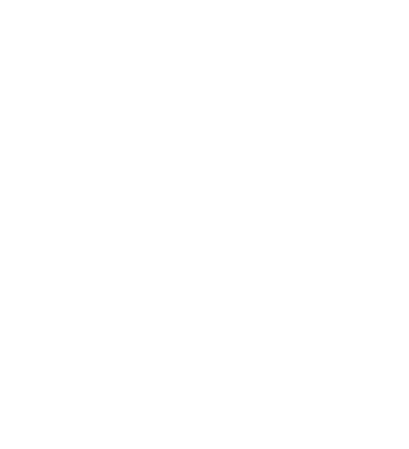
  <!-- v-click 2 : quivers travel from circle to left stack -->
  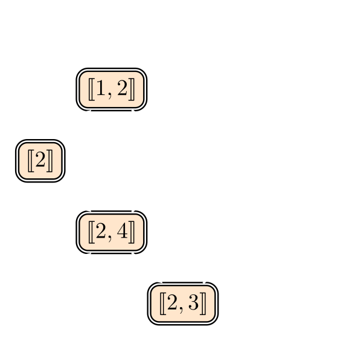
  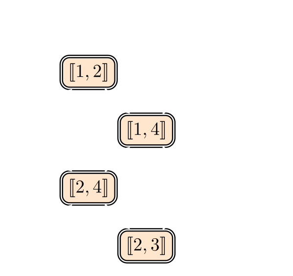
  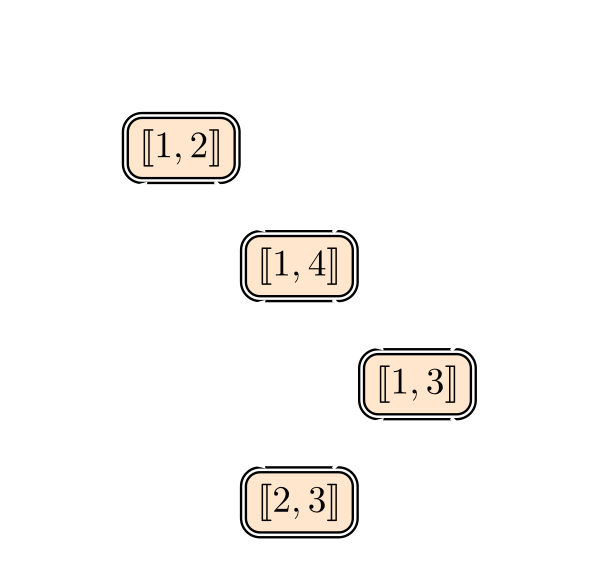
  <!-- v-click 3 : swap to highlighted versions -->
  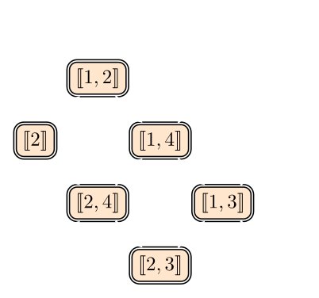
  
  
  <!-- formula fades in after highlights, no extra vclick -->
  

$\mathrm{GS}_{\mathcal{E}_\diamond}(T_1) = \mathrm{GS}_{\mathcal{E}_\diamond}(T_2) = \mathrm{GS}_{\mathcal{E}_\diamond}(T_3)$

  

---

# Second Main Theorem

**Theorem \[DR25\]**

Let $T \in \operatorname{Tilt}(Q)$. Then

$$\operatorname{GS}_{\mathcal{E}}(T) \;=\; \operatorname{add}\!\left( \bigoplus_{T' \in [T]_{\approx_{\mathcal{E}}}} T' \right).$$

**Example.** Assume $Q = 1 \to 2 \leftarrow 3 \to 4$ and $\mathcal{E} = \mathcal{E}_\diamond$.

  

    
    
    
  

  

$[T_1]_{\approx_{\mathcal{E}_\diamond}}=[T_2]_{\approx_{\mathcal{E}_\diamond}}=[T_3]_{\approx_{\mathcal{E}_\diamond}}$

  

  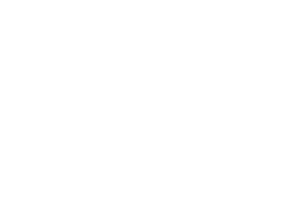

<!-- v-click 4: 4 boxes from T1 travel to plain quiver -->
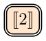
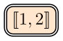
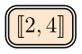
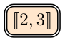
<!-- v-click 5: 4 boxes from T2 travel to plain quiver -->

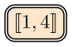

<!-- v-click 6: 4 boxes from T3 travel to plain quiver -->

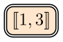

<!-- v-click 7: GS formula result -->

$\operatorname{GS}_{\mathcal{E}_\diamond}(T_1) = \operatorname{add}(T_1 \oplus T_2 \oplus T_3)$

---

# Consequences of the Second Main Theorem

**Corollary**

Let $Q$ be a quiver of type $A_n$.

<v-clicks>

<em>(a)</em> There is a bijection

$$\operatorname{Tilt}(Q) / {\approx_{\mathcal{E}_\diamond}} \;\longleftrightarrow\; \bigl\{\text{maximal CJR subcategories of } \operatorname{rep}(Q)\bigr\}.$$

<em>(b)</em> Let $\mathscr{C} \subseteq \operatorname{rep}(Q)$ be a maximal canonically Jordan recoverable subcategory. Then there exists $T \in \operatorname{Tilt}(Q)$ such that

$$\mathscr{C} = \operatorname{add}\!\left( \bigoplus_{T' \in [T]_{\approx_{\mathcal{E}_\diamond}}} T' \right).$$

</v-clicks>

---

# Synthesis and Outlook

**A unified picture of exact structures and Jordan recoverability**

<v-clicks>

- The **diamond exact structure** $\mathcal{E}_\diamond$ provides a natural framework connecting tilting theory and Jordan recoverability.

- Every maximal canonically Jordan recoverable subcategory emerges as $\operatorname{GS}_{\mathcal{E}_\diamond}(T)$ for some tilting object $T$.

- Two tilting objects $T, T'$ satisfy $\operatorname{GS}_{\mathcal{E}}(T) = \operatorname{GS}_{\mathcal{E}}(T')$ if and only if they are related by a sequence of **$\mathcal{E}$-mutations**.

- There is a bijection
$$\operatorname{Tilt}(Q)/{\approx_{\mathcal{E}_\diamond}} \;\longleftrightarrow\; \{\text{maximal CJR subcategories of }\operatorname{rep}(Q)\},$$
given by $[T]_{\approx_{\mathcal{E}_\diamond}} \;\longmapsto\; \operatorname{add}\!\Bigl(\bigoplus_{T' \in [T]_{\approx_{\mathcal{E}_\diamond}}} T'\Bigr)$.

</v-clicks>

---
layout: center
---

# Thank you for listening!

Questions?

  

  Sunny Roy &nbsp;·&nbsp; ICRA 2026 &nbsp;·&nbsp; Grenoble

